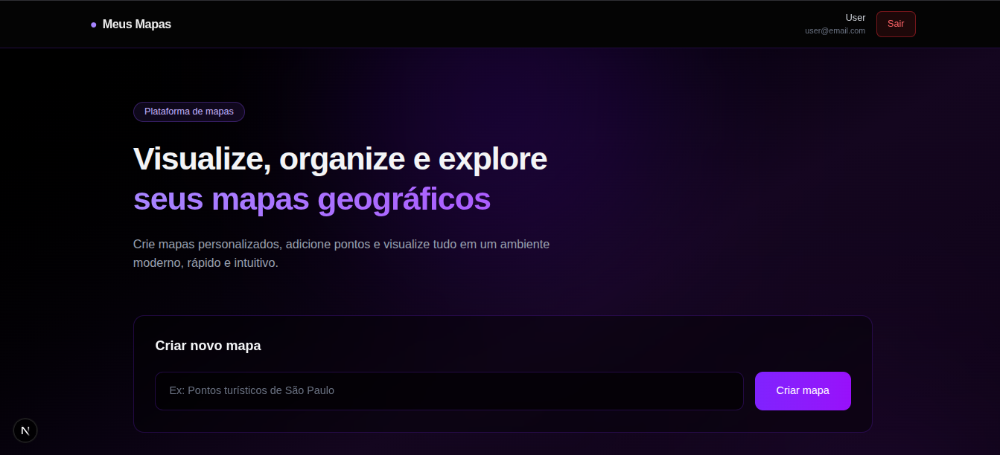
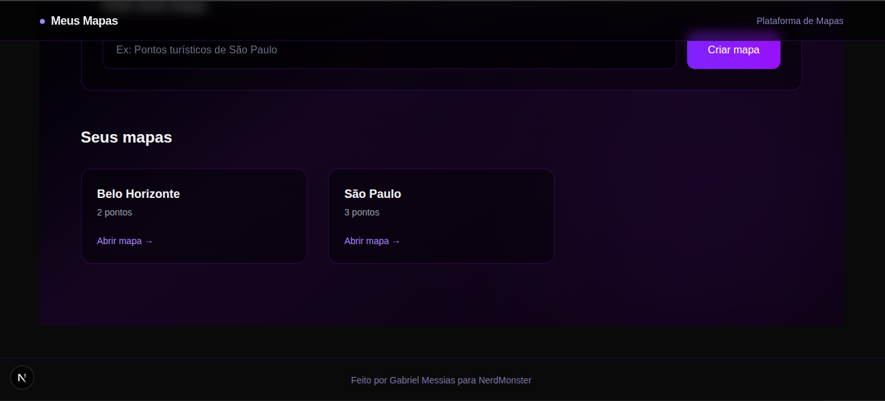
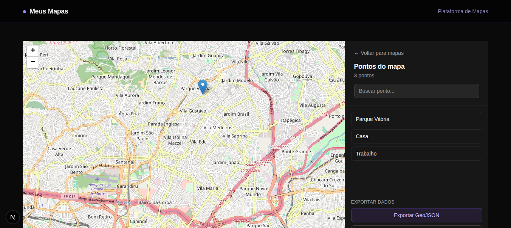
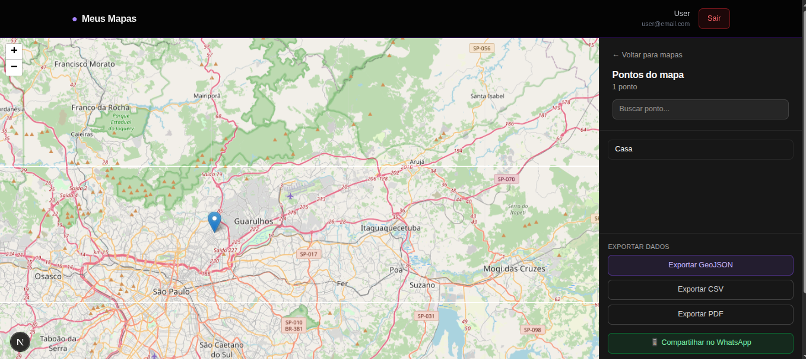

# Meus Mapas

Uma plataforma web moderna e completa para gerenciamento de mapas geográficos com pontos de interesse. Permite criar múltiplos mapas personalizados, adicionar pontos interativamente, gerenciar dados geográficos e exportar em diversos formatos.



A aplicação já está disponível online: https://mapasnerd.vercel.app

Para testar, use o seguinte login de teste:

E-mail: email@teste.com

Senha: 12345678
## 📋 Índice

- [Sobre o Projeto](#-sobre-o-projeto)
- [Funcionalidades](#-funcionalidades)
- [Tecnologias Utilizadas](#-tecnologias-utilizadas)
- [Instalação e Execução](#-instalação-e-execução)
- [Estrutura do Projeto](#-estrutura-do-projeto)
- [Screenshots](#-screenshots)
- [Arquitetura](#-arquitetura)
- [Banco de Dados](#-banco-de-dados)
- [API Endpoints](#-api-endpoints)

## 🎯 Sobre o Projeto

**Meus Mapas** é uma aplicação full-stack desenvolvida para gerenciamento completo de mapas geográficos. A plataforma oferece uma interface intuitiva e moderna onde usuários podem criar mapas personalizados, adicionar pontos de interesse através de cliques interativos no mapa, gerenciar seus dados e exportar informações em múltiplos formatos.

A solução implementa autenticação de usuários, garantindo que cada usuário tenha acesso exclusivo aos seus próprios mapas e pontos, proporcionando privacidade e organização dos dados.

## ✨ Funcionalidades

### Autenticação e Segurança
- ✅ Sistema de registro e login de usuários
- ✅ Autenticação baseada em sessões
- ✅ Isolamento de dados por usuário
- ✅ Hash de senhas com bcrypt

### Gerenciamento de Mapas
- ✅ Criar múltiplos mapas personalizados
- ✅ Visualizar lista de mapas com contagem de pontos
- ✅ Excluir mapas e todos os pontos associados
- ✅ Navegação intuitiva entre mapas

### Pontos Geográficos
- ✅ Adicionar pontos clicando diretamente no mapa
- ✅ Nomear pontos personalizados
- ✅ Buscar pontos por nome em tempo real
- ✅ Excluir pontos individuais ou em lote
- ✅ Visualização de coordenadas (latitude/longitude)

### Mapa Interativo
- ✅ Mapa interativo usando Leaflet e OpenStreetMap
- ✅ Zoom e navegação fluida
- ✅ Marcadores visuais para cada ponto
- ✅ Interface responsiva e moderna

### Exportação de Dados
- ✅ **GeoJSON**: Formato padrão para dados geográficos
- ✅ **CSV**: Planilha com todos os dados dos pontos
- ✅ **PDF**: Documento formatado com tabela de pontos

### Compartilhamento
- ✅ Compartilhar mapas via WhatsApp
- ✅ Link direto com mensagem pré-formatada
- ✅ Integração com WhatsApp Web/App

## 🛠️ Tecnologias Utilizadas

### Frontend
- **Next.js 16.1.1** - Framework React com App Router, SSR e otimizações automáticas
- **React 19.2.3** - Biblioteca para construção de interfaces de usuário
- **React Leaflet 5.0.0** - Componentes React para integração com mapas
- **Leaflet 1.9.4** - Biblioteca JavaScript para mapas interativos
- **Tailwind CSS 4** - Framework de CSS utilitário para estilização moderna
- **TypeScript 5** - Superset tipado do JavaScript para type-safety

### Backend
- **Next.js API Routes** - Backend serverless integrado com rotas RESTful
- **Better SQLite3 12.5.0** - Banco de dados SQL síncrono e de alta performance
- **bcryptjs 3.0.3** - Biblioteca para hash de senhas com segurança

### Exportação e Utilitários
- **jsPDF 4.0.0** - Geração de documentos PDF no servidor
- **OpenStreetMap** - Tiles de mapas gratuitos e abertos

### Ferramentas de Desenvolvimento
- **ESLint 9** - Linter para código JavaScript/TypeScript
- **Babel Plugin React Compiler** - Compilador otimizado para React

## 🚀 Instalação e Execução

### Pré-requisitos

Antes de começar, certifique-se de ter instalado:

- **Node.js** versão 18 ou superior
- **npm** (geralmente vem com Node.js) ou **yarn**

### Passos para Execução

1. **Clone o repositório** (se aplicável) ou navegue até a pasta do projeto:
   ```bash
   cd Mapas-o-Desafio
   ```

2. **Instale as dependências:**
   ```bash
   npm install
   ```
   
   Este comando instalará todas as dependências necessárias listadas no `package.json`.

3. **Execute o servidor de desenvolvimento:**
   ```bash
   npm run dev
   ```
   
   O servidor iniciará e estará disponível em `http://localhost:3000`

4. **Acesse a aplicação:**
   
   Abra seu navegador e acesse `http://localhost:3000`
   
   Na primeira execução, você será redirecionado para a página de registro.

5. **Crie sua conta:**
   - Acesse a página de registro
   - Preencha nome, email e senha (mínimo 6 caracteres)
   - Após o registro, você será autenticado automaticamente

### Scripts Disponíveis

```bash
# Desenvolvimento (com hot-reload)
npm run dev

# Build para produção
npm run build

# Inicia aplicação em produção (após build)
npm start

# Executa linter ESLint
npm run lint
```

### Primeiro Uso

1. **Registro**: Crie uma conta na página de registro
2. **Login**: Faça login com suas credenciais
3. **Criar Mapa**: Na página inicial, digite um nome e crie seu primeiro mapa
4. **Adicionar Pontos**: Clique no mapa para adicionar pontos de interesse
5. **Exportar**: Use os botões de exportação para baixar seus dados

## 📁 Estrutura do Projeto

```
Mapas-o-Desafio/
├── src/
│   ├── app/                          # Next.js App Router
│   │   ├── api/                      # API Routes
│   │   │   ├── auth/                 # Autenticação
│   │   │   │   ├── login/
│   │   │   │   ├── registro/
│   │   │   │   ├── logout/
│   │   │   │   └── me/
│   │   │   ├── mapas/                # CRUD de mapas
│   │   │   │   ├── route.ts
│   │   │   │   └── export/           # Exportação
│   │   │   └── pontos/               # CRUD de pontos
│   │   │       └── route.ts
│   │   ├── login/                    # Página de login
│   │   ├── registro/                 # Página de registro
│   │   ├── mapa/[id]/                # Página do mapa
│   │   ├── layout.tsx                 # Layout principal
│   │   ├── page.tsx                  # Página inicial
│   │   └── globals.css               # Estilos globais
│   ├── components/                   # Componentes React
│   │   ├── Mapa.tsx                  # Componente do mapa
│   │   └── Navbar.tsx                # Barra de navegação
│   ├── repositories/                  # Camada de acesso a dados
│   │   ├── UsuarioRepository.ts
│   │   ├── MapaRepository.ts
│   │   └── PontoRepository.ts
│   ├── services/                     # Camada de lógica de negócio
│   │   ├── AuthService.ts
│   │   ├── MapaService.ts
│   │   └── PontoService.ts
│   ├── types/                        # Definições TypeScript
│   │   └── index.ts
│   ├── lib/                          # Configurações
│   │   └── db.ts                     # Configuração do banco
│   └── middleware.ts                 # Middleware de autenticação
├── img/                              # Screenshots do projeto
│   ├── img1.png
│   ├── img2.png
│   ├── img3.png
│   └── img4.png
├── public/                           # Arquivos estáticos
├── db.sqlite                         # Banco de dados SQLite 
├── package.json                      # Dependências e scripts
├── tsconfig.json                     # Configuração TypeScript
├── next.config.ts                    # Configuração Next.js
└── README.md                         # Este arquivo
```

## 🖼️ Screenshots

### Tela Inicial - Lista de Mapas
A página inicial exibe todos os mapas criados pelo usuário, com informações sobre a quantidade de pontos em cada mapa.


### Visualização do Mapa
Interface completa com mapa interativo e painel lateral para gerenciamento de pontos.



### Adicionando Novo Ponto
Ao clicar no mapa, é possível adicionar um novo ponto e nomeá-lo através do formulário.



### Exportação de Dados
Opções para exportar os dados do mapa em diferentes formatos (GeoJSON, CSV, PDF) e compartilhar via WhatsApp.



## 🏗️ Arquitetura

A aplicação segue uma arquitetura em camadas, separando responsabilidades de forma clara:

### Camada de Repositories
Responsável por todas as operações de acesso ao banco de dados:
- `UsuarioRepository`: Operações CRUD de usuários
- `MapaRepository`: Operações CRUD de mapas
- `PontoRepository`: Operações CRUD de pontos

### Camada de Services
Contém a lógica de negócio e validações:
- `AuthService`: Autenticação, login, registro e gerenciamento de sessões
- `MapaService`: Lógica de mapas com validação de permissões
- `PontoService`: Lógica de pontos com validação de permissões

### Camada de API Routes
Endpoints HTTP que recebem requisições e chamam os services apropriados.

### Fluxo de Dados

```
Cliente → API Route → Service → Repository → Banco de Dados
                ↓
         Validações e
         Lógica de Negócio
```

## 💾 Banco de Dados

O banco de dados SQLite é criado automaticamente na primeira execução do projeto. O arquivo `db.sqlite` será gerado na raiz do projeto.

### Schema das Tabelas

**Tabela `usuarios`:**
```sql
CREATE TABLE usuarios (
  id INTEGER PRIMARY KEY AUTOINCREMENT,
  email TEXT UNIQUE NOT NULL,
  nome TEXT NOT NULL,
  senha TEXT NOT NULL,
  criado_em TEXT NOT NULL
);
```

**Tabela `mapas`:**
```sql
CREATE TABLE mapas (
  id INTEGER PRIMARY KEY AUTOINCREMENT,
  nome TEXT NOT NULL,
  usuario_id INTEGER NOT NULL,
  criado_em TEXT NOT NULL,
  FOREIGN KEY (usuario_id) REFERENCES usuarios(id) ON DELETE CASCADE
);
```

**Tabela `pontos`:**
```sql
CREATE TABLE pontos (
  id INTEGER PRIMARY KEY AUTOINCREMENT,
  mapa_id INTEGER NOT NULL,
  nome TEXT NOT NULL,
  latitude REAL NOT NULL,
  longitude REAL NOT NULL,
  endereco TEXT,
  altitude REAL,
  FOREIGN KEY (mapa_id) REFERENCES mapas(id) ON DELETE CASCADE
);
```

### Relacionamentos

- Um **usuário** pode ter múltiplos **mapas**
- Um **mapa** pode ter múltiplos **pontos**
- Exclusão em cascata: ao excluir um mapa, todos os pontos são excluídos automaticamente
- Exclusão em cascata: ao excluir um usuário, todos os mapas e pontos são excluídos

## 🔌 API Endpoints

### Autenticação

#### `POST /api/auth/registro`
Cria uma nova conta de usuário.

**Body:**
```json
{
  "email": "usuario@example.com",
  "nome": "Nome do Usuário",
  "senha": "senha123"
}
```

#### `POST /api/auth/login`
Autentica um usuário e cria uma sessão.

**Body:**
```json
{
  "email": "usuario@example.com",
  "senha": "senha123"
}
```

#### `POST /api/auth/logout`
Encerra a sessão do usuário atual.

#### `GET /api/auth/me`
Retorna informações do usuário autenticado.

### Mapas

#### `GET /api/mapas`
Retorna todos os mapas do usuário autenticado.

#### `POST /api/mapas`
Cria um novo mapa.

**Body:**
```json
{
  "nome": "Nome do Mapa"
}
```

#### `DELETE /api/mapas`
Exclui um mapa e todos os seus pontos.

**Body:**
```json
{
  "id": 1
}
```

### Pontos

#### `GET /api/pontos?mapaId=1`
Retorna todos os pontos de um mapa específico.

**Query Parameters:**
- `mapaId` (obrigatório): ID do mapa
- `format` (opcional): `geojson` ou `csv` para exportação

#### `POST /api/pontos`
Adiciona um novo ponto ao mapa.

**Body:**
```json
{
  "mapaId": 1,
  "nome": "Nome do Ponto",
  "latitude": -23.5505,
  "longitude": -46.6333,
  "endereco": "Endereço opcional",
  "altitude": 760.0
}
```

#### `DELETE /api/pontos`
Exclui um ponto ou todos os pontos de um mapa.

**Body (excluir um ponto):**
```json
{
  "id": 1
}
```

**Body (excluir todos os pontos):**
```json
{
  "mapaId": 1
}
```

### Exportação

#### `GET /api/mapas/export?mapaId=1&format=pdf`
Exporta os pontos de um mapa em diferentes formatos.

**Query Parameters:**
- `mapaId` (obrigatório): ID do mapa
- `format` (obrigatório): `geojson`, `csv` ou `pdf`

## 🎨 Design e Interface

A interface foi desenvolvida com foco em usabilidade e experiência do usuário:

- **Tema Escuro**: Interface com fundo escuro para reduzir fadiga visual
- **Gradientes Modernos**: Uso de cores violeta/purple para elementos de destaque
- **Glassmorphism**: Efeito de vidro fosco em cards e elementos flutuantes
- **Responsividade**: Layout adaptável para diferentes tamanhos de tela
- **Feedback Visual**: Confirmações antes de ações destrutivas
- **Animações Suaves**: Transições e hover effects para melhor interatividade

## 🔐 Segurança

A aplicação implementa várias medidas de segurança:

- **Hash de Senhas**: Senhas são hasheadas com bcrypt antes de serem armazenadas
- **Autenticação por Sessão**: Cookies HTTP-only para gerenciamento de sessões
- **Isolamento de Dados**: Cada usuário acessa apenas seus próprios mapas
- **Validação de Entrada**: Todas as APIs validam dados de entrada
- **Type Safety**: TypeScript garante type-safety em todo o código
- **Prepared Statements**: Queries SQL usam prepared statements para prevenir SQL injection

## 📝 Fluxo de Uso

1. **Registro/Login**: Crie uma conta ou faça login
2. **Criar Mapa**: Na página inicial, digite um nome e crie um novo mapa
3. **Acessar Mapa**: Clique em um mapa da lista para abri-lo
4. **Adicionar Pontos**: Clique em qualquer lugar do mapa para adicionar um ponto
5. **Nomear Ponto**: Digite um nome para o ponto e confirme
6. **Buscar Pontos**: Use a barra de pesquisa para filtrar pontos por nome
7. **Gerenciar Pontos**: Exclua pontos individuais ou todos de uma vez
8. **Exportar Dados**: Exporte seus dados em GeoJSON, CSV ou PDF
9. **Compartilhar**: Compartilhe seu mapa via WhatsApp

## 🚀 Deploy

Para fazer deploy da aplicação em produção:

```bash
# Build para produção
npm run build

# Verificar se build foi bem-sucedido
npm start
```

### Configuração no Vercel

Ao fazer deploy no Vercel, configure a variável de ambiente para o compartilhamento via WhatsApp funcionar corretamente:

1. Acesse as configurações do projeto no Vercel
2. Vá em **Settings** → **Environment Variables**
3. Adicione a variável:
   - **Nome**: `NEXT_PUBLIC_APP_URL`
   - **Valor**: A URL do seu deploy (ex: `https://meus-mapas.vercel.app`)
4. Faça o redeploy da aplicação

**Nota**: Se não configurar a variável, o sistema usará automaticamente a URL atual (que em produção será a URL do Vercel).


## 📄 Licença
 A construção desse projeto foi para um processo seletivo.
---

**Desenvolvido com tecnologias modernas: Next.js, React, TypeScript e Leaflet**
